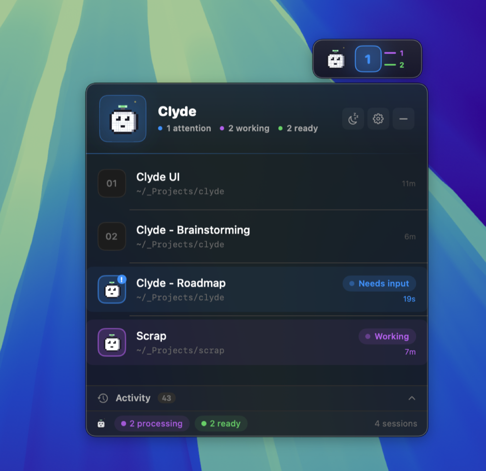
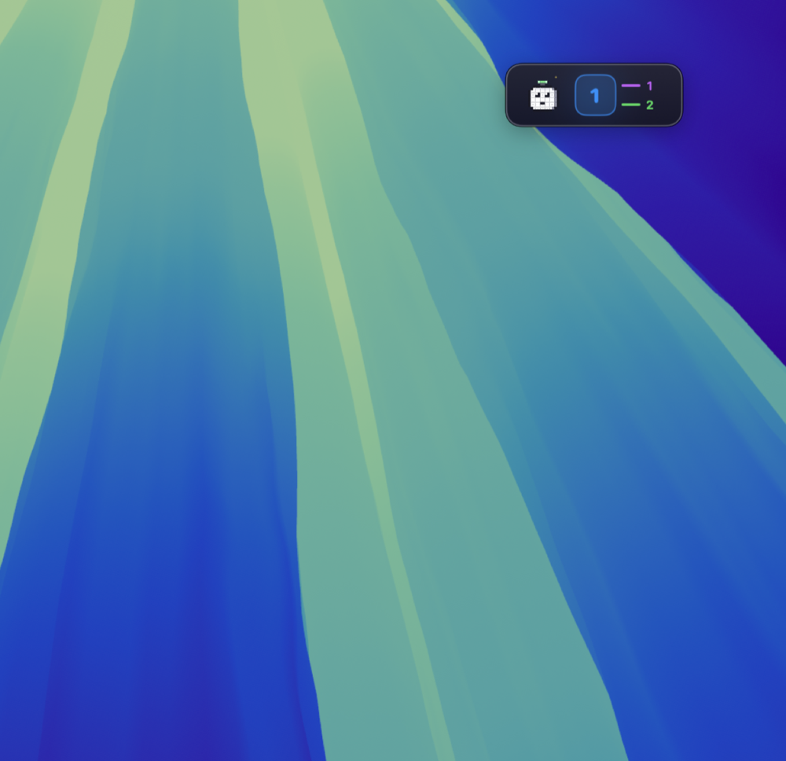

<div align="center">


# Clyde

**A friendly Claude Code session monitor for macOS.**

Know what Claude is doing — without alt-tabbing.

[Website](https://kl0sin.github.io/clyde/) ·
[Download](https://github.com/kl0sin/clyde/releases/latest) ·
[Changelog](CHANGELOG.md)

[](LICENSE)


</div>

---

Clyde is a tiny SwiftUI menu bar app that watches every
[Claude Code](https://claude.com/claude-code) session running on your Mac
and shows you, in one glance, whether they're working, ready, or need
your attention.

It connects to Claude Code's native hook events, so updates are
**instant** — no polling, no lag, no missed permission requests.

## Features

- 🟢 **Real-time session tracking** — busy / ready / needs-input, fed by
  Claude Code's native hooks. No polling.
- 🔔 **Attention alerts** — sound and macOS notification the moment
  Claude asks for permission. Never miss a prompt again.
- 🗂 **Multi-session view** — every Claude session, every terminal, in
  one expandable panel. Drag to reorder, name them, click to focus the
  matching window.
- 📜 **Activity timeline** — recent prompts, permissions and session
  lifecycle, in plain language.
- 🎯 **Menu bar capsule** — dominant state at a glance, with two ticks
  for the other states.
- 💤 **Snooze** — 15 / 30 / 60 / 120 minute mute when you need quiet.
- ⌨️ **Global hotkey** — `⌃⌘C` to expand from anywhere.
- 🛠 **Self-installs the hook** — Clyde adds and self-heals its hook
  script in `~/.claude/hooks/` so you never have to think about it.
- 🔒 **Privacy-first** — no telemetry, no network calls, no accounts.
  Everything stays on your Mac.

## Install

Grab the latest `.dmg` from
[Releases](https://github.com/kl0sin/clyde/releases/latest), open it,
drag `Clyde.app` into your Applications folder, and launch it.

On first run Clyde offers to install its Claude Code hook automatically —
accept and you're done.

> **Early releases are not yet code-signed or notarized.** On first
> launch macOS Gatekeeper will say the app is "from an unidentified
> developer". Right-click `Clyde.app` → **Open** → confirm in the
> dialog. macOS remembers the exception, so subsequent launches are
> clean. Signing and notarization are on the roadmap and will land in
> a later release.

### Updates

Clyde ships with [Sparkle](https://sparkle-project.org/) built in for
in-app auto-updates. The update channel is dormant until signed
releases start publishing to the appcast — until then, grab new
versions from
[Releases](https://github.com/kl0sin/clyde/releases) directly.

## How it works

Clyde reads two things from your local file system:

- `~/.claude/` — to install its hook script and discover Claude Code's
  settings.
- `~/.clyde/` — where the hook script writes per-session state files
  that Clyde watches via FSEvents.

When you submit a prompt, Claude Code fires a `UserPromptSubmit` hook →
the hook script writes a `<sessionId>-busy` marker → Clyde sees it
within milliseconds and updates the UI. When Claude finishes, the `Stop`
hook removes the marker. Permission requests fire `PermissionRequest` →
Clyde rings a sound and shows the attention pill.

That's the entire architecture. No polling, no daemon, no privileged
helpers.

## Screenshots

**The expanded view — every Claude session at a glance.**
Hero header tells you the dominant state, the list shows each session
with its directory, and the activity bar at the bottom keeps a
running tally.



**The collapsed widget.** Floats wherever you drop it. The big number
is the dominant state count; the two ticks on the right show the
others. Click to expand, drag to move, hide entirely if you only want
the menu bar.



**The menu bar item.** Pixel‑accurate Clyde silhouette plus a colour
capsule for the dominant state — purple = working, green = ready,
blue = needs attention.


## Build from source

Clyde is a single self-contained Swift Package. No Xcode project,
nothing to configure.

```bash
git clone https://github.com/kl0sin/clyde.git
cd clyde
swift run Clyde
```

For a release build wrapped in a proper `.app` bundle:

```bash
scripts/release/build.sh
open build/release/Clyde.app
```

See [`docs/release-process.md`](docs/release-process.md) for the full
release pipeline (signing, notarization, DMG, appcast, GitHub Releases).

## Project layout

```
Clyde/                  Main app source
├── App/                NSApplicationDelegate, panel + menu bar
├── Models/             Session, ClydeState, ActivityEvent
├── Services/           ProcessMonitor, AttentionMonitor, hook installer, ...
├── ViewModels/         App + session list view models
├── Views/              SwiftUI views
├── Resources/          clyde-hook.sh (the hook script that ships in the bundle)
└── Assets/             AppIcon.icns (generated by scripts/generate-icon.swift)

ClydeTests/             XCTest test target
scripts/                Build + release tooling
site/                   GitHub Pages landing page (deployed via Actions)
Casks/                  Homebrew cask formula
.github/workflows/      CI: deploy-site.yml, release.yml
docs/                   Pre-launch checklist + release process docs
```

## Tests

```bash
swift test
```

The suite is hermetic — `HookInstallerTests` redirects every path
through a throwaway temp home via `AppPaths.homeOverride`, so nothing
under your real `~/.claude/` is ever touched. Runs deterministically
across reruns on dev machines and CI alike.

## Contributing

Bug reports and PRs welcome. For non-trivial changes please open an
issue first so we can discuss the approach.

## Support development

Clyde is free and MIT-licensed. If it's saving you time and you'd
like to chip in, there are two ways:

- ❤️  [Sponsor on GitHub](https://github.com/sponsors/kl0sin) — recurring or one-time, processed by GitHub.
- ☕ [Buy me a coffee](https://www.buymeacoffee.com/kl0sin) — one-off tip, no account needed.

Both are entirely optional and there's no paid tier — Clyde stays
fully featured for everyone.

## License

[MIT](LICENSE) — use it, fork it, sell it, do whatever.

---

<sub>Built in SwiftUI with care by <a href="https://github.com/kl0sin">Mateusz Kłosiński</a>.</sub>
